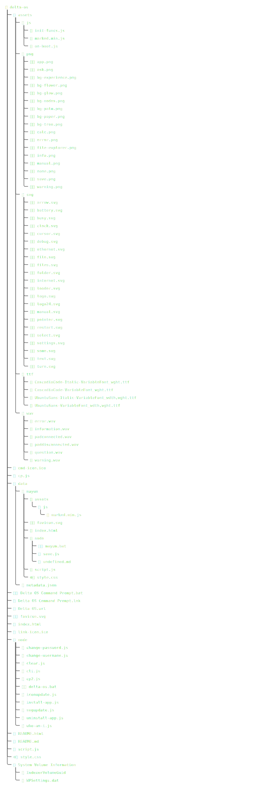

# Delta OS

A browser-based desktop experience built with vanilla HTML, CSS, and JavaScript. Delta OS simulates a personal operating system environment — complete with a login screen, windowed apps, a taskbar, and a Node.js CLI for managing your setup.

---

## Getting Started

### Requirements

- [Node.js](https://nodejs.org/) installed on your machine

### Running Delta OS

Open the terminal (by double clicking `Delta OS Command Prompt.lnk`) and run:

```
delta-os open
```

This starts a local server using `npx serve`. Open the URL it gives you in your browser.

> Delta OS **must** be served through localhost. Opening `index.html` directly as a file will cause the login system to fail, since the browser won't be able to fetch `data/metadata.json`.

---

## CLI Commands

All commands are run from the `node/` directory:

| Command | Description |
|---|---|
| `delta-os help` | List all available commands in a table |
| `delta-os open` | Start the local server and open Delta OS |
| `delta-os install-app` | Download and install an app |
| `delta-os change-password` | Change your password |
| `delta-os change-username` | Change your username |
| `delta-os uninstall-app` | Uninstall an app |
| `delta-os who-am-i` | Shows your password (SHA256) and your username |

---

## Project Structure



---

## Window System

Delta OS includes a small UI framework for creating windows via tagged template literals:

```js
open("My App", 800, 600)`
    <p>Hello from my app!</p>
    <button id="ok">OK</button>
`;
```

Available window types: `open`, `info`, `error`, `warn` and `ask`.

Each type renders a styled window with its own icon and close controls. Pass a `funcTable` object to wire up button IDs to callbacks:

```js
const actions = {
    ok: () => console.log("clicked"),
    closed: () => {}, // The close button
    func: () => {} // This function runs when window's opened, always make sure leave it at last.
};

info("Notice", actions)`
    <p>Something happened.</p>
    <button id="ok">OK</button>
`;
```

---

## Debug Mode

Append `?debug=enabled` to the localhost URL to enable verbose debug window logging:

```
http://localhost:3000?deltaos=true&debug=enabled
```

---

## Username and password

- Username: `User`
- Password: `user_123`

This user data is by default, **you need to urgently change them**.

---

## License

Delta Corp. &reg; / TM
